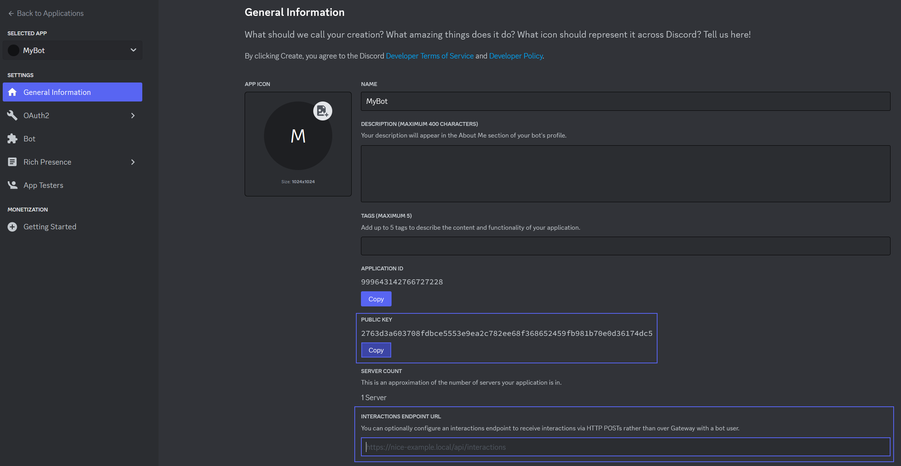

# HTTP Interactions

Discord allows you to receive interactions via HTTP requests. They can be handled easily using the [NetCord.Hosting.AspNetCore](https://www.nuget.org/packages/NetCord.Hosting.AspNetCore) package. The package can be effortlessly integrated with the [NetCord.Hosting.Services](https://www.nuget.org/packages/NetCord.Hosting.Services) package. You can also implement your own @NetCord.Hosting.IHttpInteractionHandler and add it using @NetCord.Hosting.HttpInteractionHandlerServiceCollectionExtensions.AddHttpInteractionHandler``1(Microsoft.Extensions.DependencyInjection.IServiceCollection) to handle interactions manually.

## Native Dependencies

Follow the [installation guide](installing-native-dependencies.md) to install the required native dependencies.

## Usage

To handle HTTP interactions, you need to use @NetCord.Hosting.Rest.RestClientServiceCollectionExtensions.AddDiscordRest(Microsoft.Extensions.DependencyInjection.IServiceCollection) to add the @NetCord.Rest.RestClient and then call @NetCord.Hosting.AspNetCore.EndpointRouteBuilderExtensions.UseHttpInteractions(Microsoft.AspNetCore.Routing.IEndpointRouteBuilder,System.String) to map the interactions route.

[!code-cs[Program.cs](HttpInteractions/Program.cs?highlight=10,17-18)]

## Finding Public Key and Specifying Interaction Endpoint URL

To make your bot receive interactions, you need to store the public key in the configuration and specify the endpoint URL in the [Discord Developer Portal](https://discord.com/developers/applications).



### Specifying Public Key in Configuration

You can for example use `appsettings.json` file for configuration. It should look like this:
[!code-json[appsettings.json](HttpInteractions/appsettings.json?highlight=4)]

### Specifying Interaction Endpoint URL

If your bot is hosted at `https://example.com` and you have specified `/interactions` pattern in @NetCord.Hosting.AspNetCore.EndpointRouteBuilderExtensions.UseHttpInteractions*, the endpoint URL will be `https://example.com/interactions`. Also note that Discord sends validation requests to the endpoint URL, so your bot must be running while updating it.

For local testing, you can use [ngrok](https://ngrok.com). Use the following command to start ngrok with a correct port specified:
```bash
ngrok http https://localhost:port
```

It will generate a URL that you can use to receive interactions. For example, if the URL is `https://random-subdomain.ngrok-free.app` and you have specified `/interactions` pattern in @NetCord.Hosting.AspNetCore.EndpointRouteBuilderExtensions.UseHttpInteractions*, the endpoint URL will be `https://random-subdomain.ngrok-free.app/interactions`.
